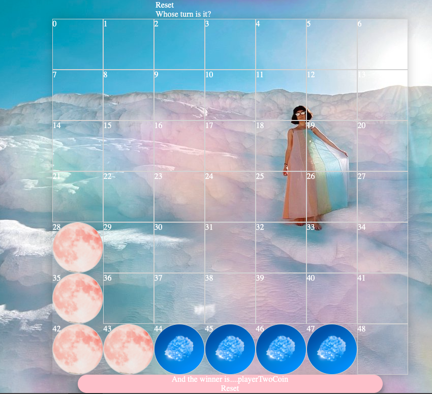

# 🟡*CONNECT-4*🔴

This was my first project for General Assembly’s Software Engineering Immersive course. Working solo after just 2 weeks of learning to code, we had ten days to build a game in a single-page front-end using Vanilla Javascript, HTML and CSS. 

**[Full page screenshot]**

### Deployment

This website was deployed using GitHub pages.

### Brief 

We were assigned an individual project with the goal of building a single-page game using JavaScript, HTML and CSS.

**Requirements:** 
* Render a game in the browser
* Design logic for winning & visuals display which player won
* Include separate HTML, CSS and JavaScript files
* Use Javascript for DOM manipulation
* Deploy your game online, using Github Pages, where the rest of the world can access it
* Use semantic markup for HTML and CSS

**Requirements Specific to Connect-4:**
* The game should be playable for two players on the same computer, taking turns to make their moves
* The winner should be displayed when the game is over
* The game cannot be built with Canvas
### Technologies Used

**Front-End:**
* JavaScript (ES6)
* HTML5
* CSS3

**Dev Tools:**
* VSCode
* Eslint
* Git
* GitHub
* Google Chrome Dev Tools
* Google Fonts

### How To Install
1. Clone or download the repo from GitHub onto your machine.
2. Open index.html file in your browser

### Concept 
Connect 4 was one of my favourite games as a child so I decided to build this for my first project in the course. As the game is two player and built on a simple single-page application, users take it in turns to select a column in which to drop their coins, until either the board is full or a player has succeeded in connecting 4 coins either in a row, column or horizontal line. 

### Wireframe:

```
Wireframe: 

Simple page setup up with:
* title
* reset button
* grid for the connect-4 structure
* "Who's go is it?"
* Winner status
```

### Process:
First I established the grid in the App.js file to show a seven by seven connect 4 frame. The connect-4 board is 7 columns by 6 rows, and there was an added top row for displaying the coin when the user selects a column, therefore generating 49 cells in total:

```
const grid = document.querySelector('.grid')
  let playSounds = document.querySelectorAll('.topRow')
  // console.log(grid)

  
  const width = 7
  const height = 7
  const cellCount = width * height
  let cells = []
  const isGameOver = document.querySelector('#gameover')

  const winnerIs = document.querySelector('#winner-status')
  const resetGame = document.querySelectorAll('.reset')
  // const whoseGoIsIt = document.querySelector('#whosegoisit')


function createGrid() {
    for (let i=0; i < cellCount; i++) {
      const cell = document.createElement('div')
      cell.textContent = i
      cell.setAttribute('data-id', i)
      grid.appendChild(cell)
      cells.push(cell)
    }
    // console.log(cells)
    defineRowClasses()
    defineColumnClasses()
  }


```

The handlePlayerSelection function was a tricky one to establish as every time a coin was “dropped”, I needed to "pop" that cell off the array in order for it do be represented as “taken”:

```
function handlePlayerSelectsColumn(event) {
    // console.log('clicked id =', event.target.dataset.id)
    const currentTopCell = event.target.dataset.id
    // console.log(currentTopCell)
    const clickedCellColumn = event.target.classList[1]
    // above target classList not great as it's fetching just index 1 in array (which I know for the moment is the column class) and not the element that e.g."contains columnX"
    console.log(clickedCellColumn)
    // variable used to fill the cell 
    let cellToFill
    if (clickedCellColumn === 'column0') {
      //assign value to last item in column0 array
      cellToFill = column0[column0.length -1]
      console.log(cellToFill)
      console.log(column0.length -1)
      latestDrop = column0.pop()
      // console.log(column0)
    }
    else if (clickedCellColumn === 'column1') {
      cellToFill = column1[column1.length -1]
      console.log(column1.length -1)
      latestDrop = column1.pop()
    }
    else if (clickedCellColumn === 'column2') {
      cellToFill = column2[column2.length -1]
      latestDrop = column2.pop()
    }
    else if (clickedCellColumn === 'column3') {
      cellToFill = column3[column3.length -1]
      latestDrop = column3.pop()
    }
    else if (clickedCellColumn === 'column4') {
      cellToFill = column4[column4.length -1]
      latestDrop = column4.pop()
    }
    else if (clickedCellColumn === 'column5') {
      cellToFill = column5[column5.length -1]
      latestDrop = column5.pop()
    }
    else if (clickedCellColumn === 'column6') {
      cellToFill = column6[column6.length -1]
      latestDrop = column6.pop()
    }
    // part two of the selectsColumn function is the ternary - asking if currentPlayer equals playeroneCoin, and if so to flip to playerTwo (and vice versa):

    cells[cellToFill].classList.add(currentPlayer)
    audio.play() 
    checkHorizontalWin()
    checkVerticalWin()
    // checkDiagonalWin()

    currentPlayer = currentPlayer === 'playerOneCoin' ? 'playerTwoCoin': 'playerOneCoin'
    console.log(currentPlayer)
    cells[currentTopCell].classList.remove('playerOneCoin', 'playerTwoCoin')
    
  }

```

I then was able to present the cells in the grid as "taken" using CSS:


### Screenshots
**Work In Progress:**


### Methods
I found it really helpful annotating my work and code as I went, in order to get to grips with the logic more easily:


### Challenges Overcome
* The biggest challenge here was the logic that “fills in” a cell in the grid with a coin, in order for them to be able to stack on top of one another properly. 
* The win check also posed some confusion - with the horizontal and vertical wins being much simpler to figure out than the diagonal. 
* When testing out a "Player X wins!" popup, I had inadvertently introduced a bug which meant that only the first two columns were able to be selected by a player. This was due to using a shortcut 'z-index: 99' which I then had to remove. Below is a screenshot (styling still in progress..!) of the #gameover winner's popup:


### Wins
* Using an event listener for the coin dropping sound was a satisfying achievement.
### Key Learnings
* I definitely had many breakthrough moments during this week and although the project was missing some styling and  animation features I had wanted to implement, I made some real progression with DOM manipulation. 
* Not to make any fundamental changes right at the last minute - as something (inevitably) goes wrong. I learnt this the hard way and ended up breaking my game's functionality shortly before presentation! 
* The most important takeaway from this was that using pseudocode, annotating my progress, and DELETING CODE are all helpful and acceptable ways of developing a project. This project was all about trial and error and being comfortable with breaking the functionality.. over and over again! 

### Future Additions
* There were a number of features I didn't manage to implement, but the one I wanted to add the most was making the coins fall smoothly through the columns as they would in a real-life game. 
* Another feature would be to add a single-player feature where a user can play against the computer.
